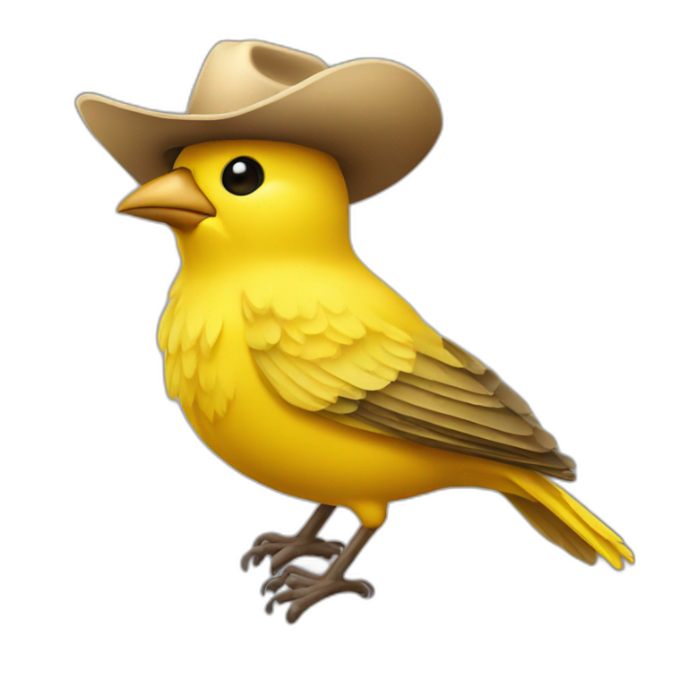

<div align="center">
  
</div>

<p align="center">
  Discord Bot: <strong>Canary Cowboy</strong><br>
  A super simple Discord Bot built and deployed with Architect.<br>
  <br>
  Contents:
  <a href="#Bot-Setup">Bot Setup</a>
  •
  <a href="#Architect">Architect</a>
  •
  <a href="#Discord Bots">Discord Bots</a>
  <br>
  Reference:
  <a href="https://arc.codes">arc.codes</a>
  •
  <a href="https://discord.com/developers/docs">discord.com/developers/docs</a>
</p>

## Bot Setup

Set up this Discord bot with the single `/chirp` command. These are the steps to get up and running if you generally understand how Discord bots work and grok Architect.

### Create a new Discord Application

Add environment variables to your `.env` file:

```sh
APPLICATION_ID=
CLIENT_PUBLIC_KEY=
SECRET_TOKEN=
```

And use `arc env` to set these in AWS.

### Register bot commands

Run `./scripts/register-commands.mjs` to register the bot commands with Discord.

```sh
node ./scripts/register-commands.mjs
```

### Deploy to AWS with Arc

Visit the root handler and follow the install link.

### Test the bot

Send a message to a channel with the `/chirp` command.  
(You may need to reload the Discord UI to see the new command.)

## Architect

[Architect](https://arc.codes) (aka "Arc") is a toolchain to help build and deploy "serverless" applications to AWS. It has several primitives for defining [HTTP](https://arc.codes/http) Lambdas, SQS [queues](https://arc.codes/queues), DynamoDB [tables](https://arc.codes/tables), and more.

These are defined in the `./app.arc` file.

Arc [emulates these services locally](https://arc.codes/docs/en/reference/cli/sandbox), so you can build/test offline.

This bot has 2 HTTP Lambdas (one is just the root `GET /` handler). The main function handles `POST /interactions` from Discord and replies with a simple message.

## Discord Bots

Discord bots have [all sorts of capabilities](https://discord.com/developers/docs/interactions/application-commands). This one is a simple "slash command" bot, which means it filters incoming POST messages for a specific "chirp" command and replies with a chat message.

This bot does not use the "gateway" websocket API (though, it could). It's just a webhook implementation that waits for a POST request from Discord and replies with a simple message.
